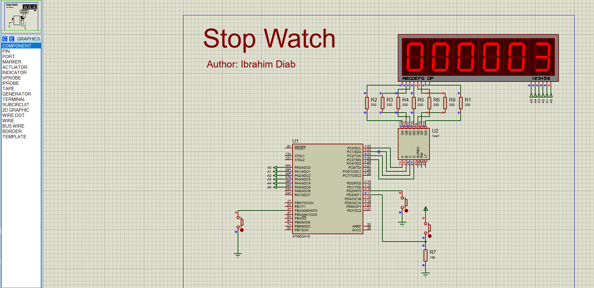

# Embedded Project: Multiplexed Stop Watch System

This repository contains the implementation of a Stop Watch system using an ATmega16 microcontroller with the specifications outlined below.

## Project Specifications

### Microcontroller
- Microcontroller: ATmega16
- Frequency: 1MHz

### Timer Configuration
- Timer: Timer1
- Mode: Clear Timer on Compare (CTC) mode
- Used for: Counting Stop Watch time

### 7-Segment Display
- Type: Common Anode
- Quantity: Six 7-segment displays
- Multiplexing: Yes

### Multiplexing Technique
- Technique: Persistence of Vision
- Method: Time-division multiplexing
- Decoder: 7447 common anode decoder
- Transistor: NPN BJT for enable/disable control

### Pin Configuration
- 7447 Decoder 4-pins: Connected to the first 4-pins of PORTC
- 7-Segment Enable/Disable Pins: First 6-pins of PORTA

### Stop Watch Functionality
- Start: Automatic start upon MCU power connection
- Reset: Falling edge trigger on External Interrupt INT0 using a push button with internal pull-up resistor
- Pause: Rising edge trigger on External Interrupt INT1 using a push button with external pull-down resistor
- Resume: Falling edge trigger on External Interrupt INT2 using a push button with internal pull-up resistor

## Circuit Diagram

## How to Use
1. Assemble the circuit as per the provided diagram.
2. Program the ATmega16 microcontroller with the appropriate code.
3. Power up the circuit.
4. The Stop Watch will automatically start counting upon power connection.
5. To reset the time, press the push button associated with External Interrupt INT0 (falling edge).
6. To pause the time, press the push button associated with External Interrupt INT1 (rising edge).
7. To resume the time after pausing, press the push button associated with External Interrupt INT2 (falling edge).

---
